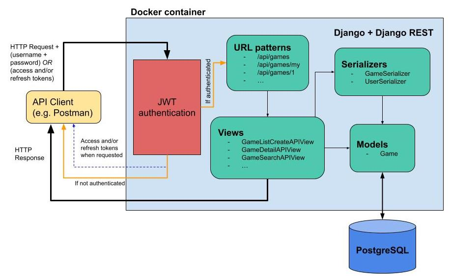
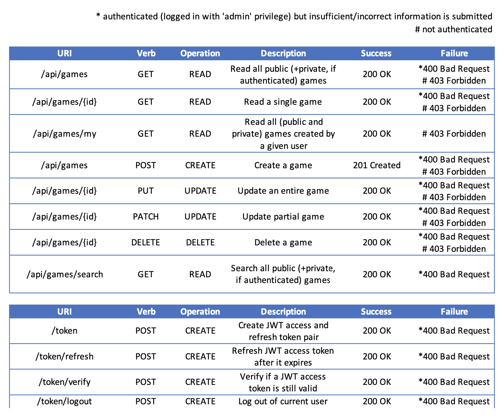
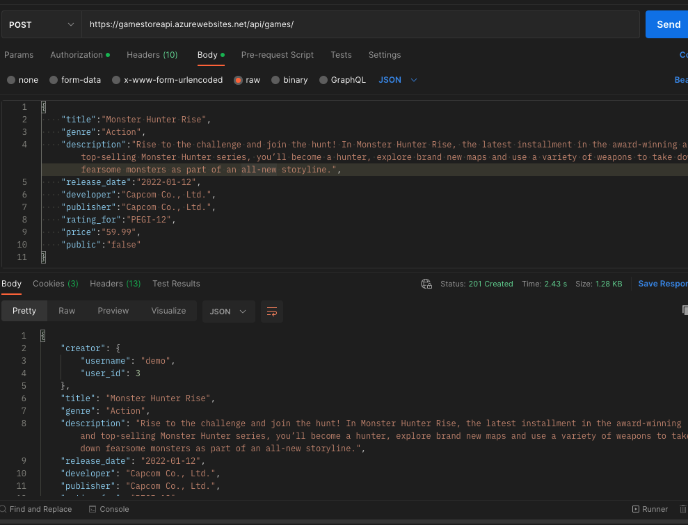
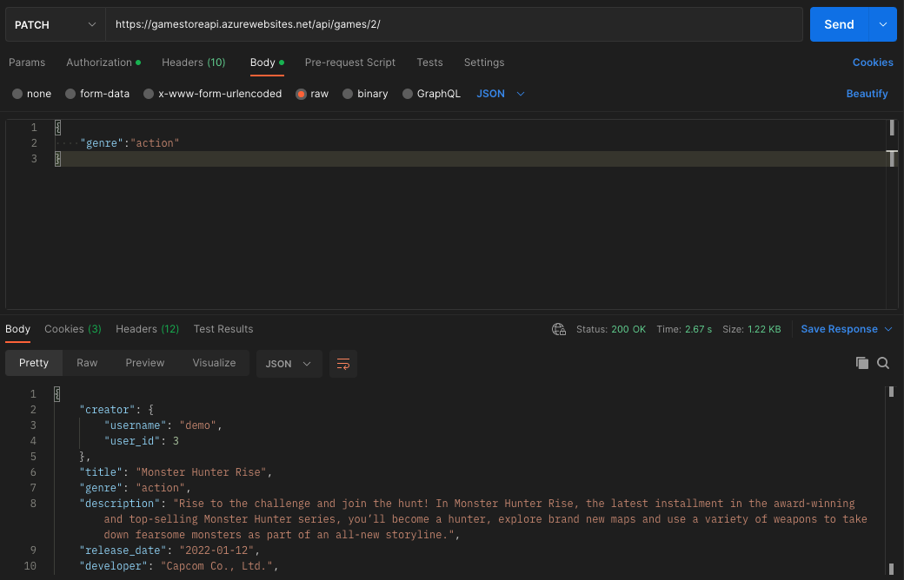

# Games REST API

A CRUD REST API containing a list of games and their details with authentication built in.

Site link: [https://gamestoreapi.azurewebsites.net](https://gamestoreapi.azurewebsites.net)

Django account with staff + 'admin' status for demo purposes:\
_Username: demo_\
_Password: omed123321_

## Purpose of this project

The purpose of this project is to learn and practice concepts related to:

- Building and testing a REST API
- Python, Django, Django REST framework
- JSON Web Tokens (JWT)
- PostgreSQL

I used the following:

- Django's MTV (Model-Template-View) Architecture
- Django's Object Relational Mapping (ORM)
- Django REST framework features (serializers and custom mixins, permissions, validators)
- Django REST JWT
- Restful API guidelines
- HTTP methods and status codes (GET, POST, PUT, PATCH, DELETE)
- Testing API endpoints (Postman, SwaggerUI)
- Docker (container, image, deploying on Docker Hub)
- Microsoft Azure (deploying Docker image to Azure)

## Authentication

JSON Web Tokens (JWT) has been implemented as the way to authenticate users. A user can obtain the access and refresh tokens by sending a POST request containing the username and password to `https://gamestoreapi.azurewebsites.net/token/`. Please use the username and password provided above to log in by using the access token provided as the _Bearer_ value in the 'Authorization' header.

The access token is configured to expire 5 minutes after generation and needs to be refreshed after it expires. This can be done by visiting the `/refresh/` endpoint.

Finally, one can sign out of the current account by navigating to `/logout/`.

## Permissions

**Unauthenticated** users can view all public game data ('public' = 'False') in `/api/games/`. **Authenticated** users however can view all data that are public **and private** ('public' = 'true' and 'false').

### Important

**A user has to have staff status + assigned to be part of the "admin" group to be able to create new game and view/update/delete the details of individual game. This is a custom permission that has been implemented. An account with staff status alone is not sufficient to perform the above operations.**

## Application Architecture

## API Endpoints

## Sample endpoints using Postman

- [POST] Creating a game, returns HTTP response of all the details of the newly created game, as well as a status code of '201 Created'.
  

- [PATCH] Partially updating a game, returns HTTP response of a game with the updated details, as well as a status code of '202 OK'.
  

## Tech Used

Python, Django, Django REST framework, Django REST JWT, and Swagger UI.

Data stored in PostgreSQL

Site hosted on Microsoft Azure

## Credits

All game data was gathered and provided by Steam.
